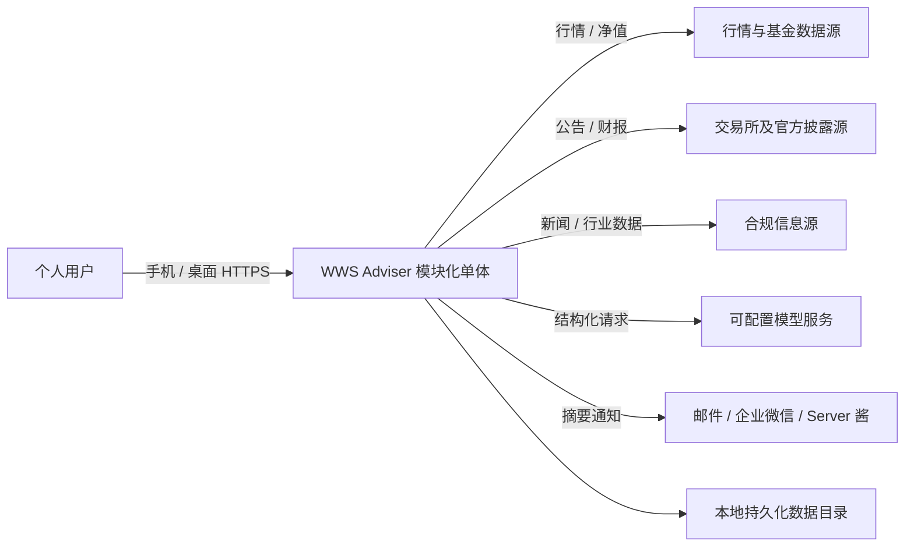
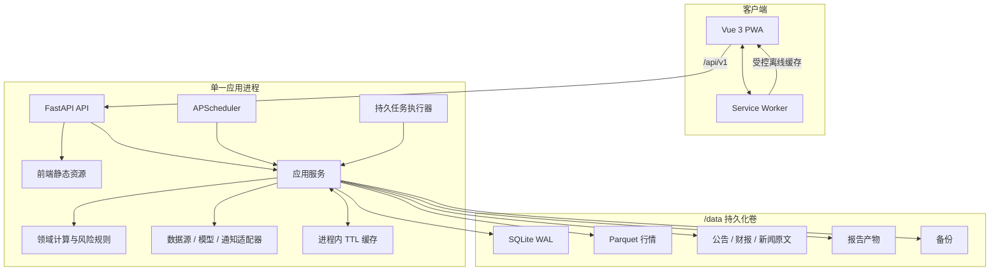
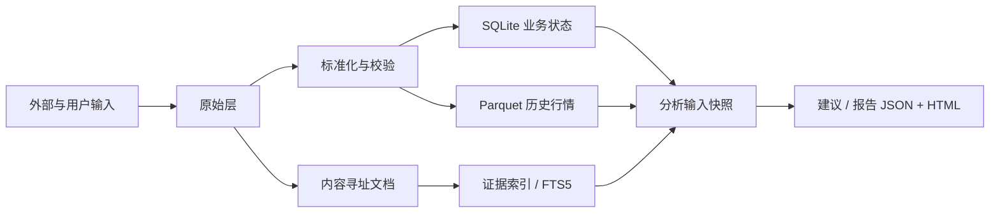
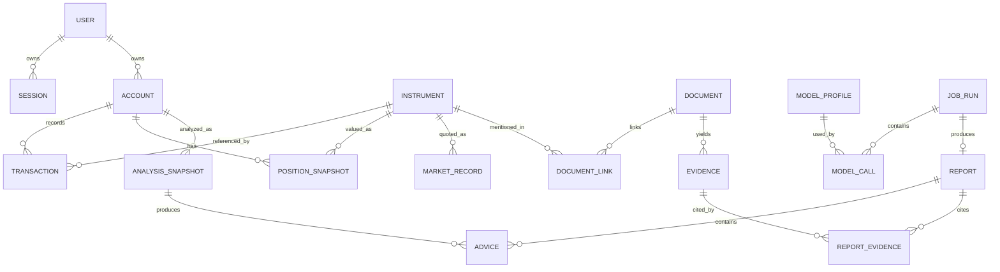
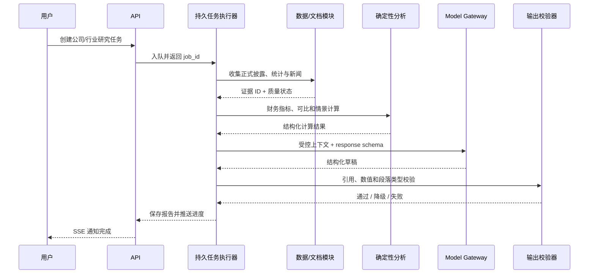
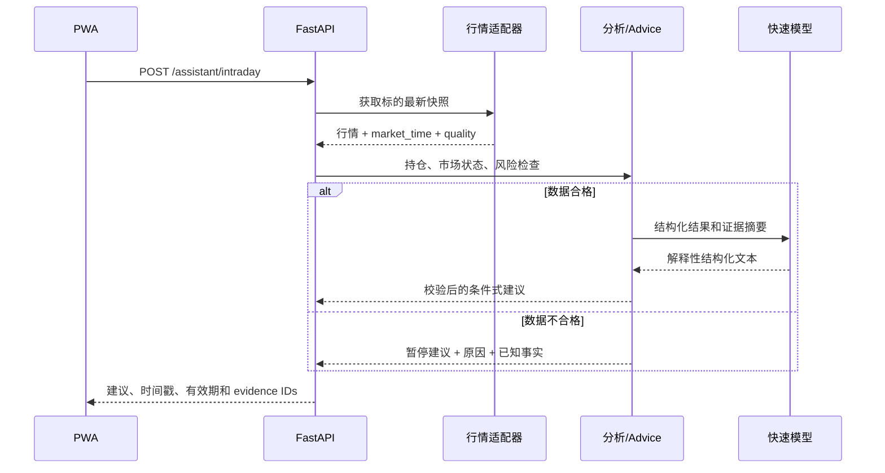
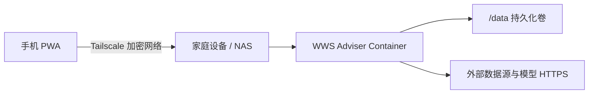

# WWS Adviser 技术架构文档

> 文档版本：v1.1  
> 文档状态：MVP 架构基线  
> 更新日期：2026-07-18  
> 变更说明：v1.1 凯利计算改为资格决策流（校准状态 → `n_eff` → reliability → `p` 区间宽度 → `b` 边界 → 折扣 → clip → 输出区间+原因链），`p` 校准对象定义为全市场同类信号、带 Wilson 置信区间；验收清单补充原因链可审计性。  
> 关联文档：[产品需求文档](./PRODUCT_REQUIREMENTS.md)  
> 适用范围：个人单用户版本；中国 A 股、场内 ETF、公募基金

## 1. 文档目的

本文档将产品需求转化为可实施的技术架构，明确系统边界、技术选型、模块职责、数据流、存储、接口、任务调度、模型接入、安全、部署、测试及扩展路径。

本文是架构基线，不替代后续数据库字段设计、API OpenAPI 定义、数据源选型和详细算法规范。开发实现若偏离本文中的关键决策，应新增架构决策记录（ADR）并说明原因、影响和迁移方案。

## 2. 架构目标与约束

### 2.1 架构目标

1. **轻量**：个人设备或轻量服务器可用一个应用容器运行，不依赖独立数据库、Redis、消息队列或向量数据库。
2. **移动优先**：同一套响应式 PWA 覆盖手机和桌面，弱网可查看已缓存报告。
3. **可审计**：任一建议均可还原持仓、行情、证据、规则、模型和提示词版本。
4. **数据可靠**：关键数据经过标准化、质量检查、来源追踪和新鲜度门禁。
5. **安全降级**：行情过期、账本未对账、模型失败或来源冲突时，停止输出危险的即时交易数量。
6. **确定性优先**：金额、持仓、指标、风险和凯利仓位由程序计算；大模型只做抽取、归纳和解释。
7. **可渐进扩展**：数据源、模型、通知和存储通过端口隔离，未来替换基础设施时不推翻业务逻辑。

### 2.2 明确约束

- MVP 是单用户、单账户、低并发系统。
- MVP 不连接券商下单，不保存券商凭据。
- MVP 不采集全市场 Tick 数据，不实现高频策略。
- 交易时段默认使用 `Asia/Shanghai`。
- 默认盘中行情新鲜度阈值为 90 秒。
- 模型服务通过 OpenAI-compatible HTTP API 接入。
- MVP 使用 SQLite WAL，因此应用只运行 **一个 Uvicorn worker**。
- 进程内调度器也要求只有一个调度实例；重复任务由数据库唯一约束和任务租约再次防护。
- 所有外部数据源的使用必须满足授权、频率、版权和服务条款。

### 2.3 MVP 容量假设

架构按以下个人使用量级设计，数字是容量边界而非产品限制：

| 维度 | 设计假设 |
| --- | --- |
| 在线用户 | 1，通常只有 1 个活跃设备，允许手机和桌面同时登录 |
| 投资账户 | 1 个人民币账户 |
| 当前持仓 | 通常 ≤ 50 个标的 |
| 持仓 + 自选监控 | 通常 ≤ 200 个标的 |
| 交易流水 | ≤ 100,000 条，远高于个人正常使用量 |
| 结构化文档元数据 | ≤ 50,000 条 |
| 盘中数据 | 只保存关注标的，按保留策略清理 |
| 并发长任务 | 默认 1 个研究任务；网络采集可有界并行 |
| 可接受停机 | 允许维护窗口，不要求高可用双机 |

达到容量边界不代表立即故障；若连续出现锁等待、任务积压、检索退化或磁盘压力，应按第 21 节的触发条件升级，而不是单纯提高并发参数。

## 3. 架构概览

### 3.1 系统上下文



### 3.2 容器视图



### 3.3 核心架构风格

系统采用 **模块化单体 + 端口/适配器**。所有业务功能运行在一个可部署单元内，但代码按领域模块隔离。模块之间通过应用服务和显式接口协作，不跨模块直接修改数据库表。

架构分为四层：

| 层 | 职责 | 依赖方向 |
| --- | --- | --- |
| 接口层 | HTTP API、静态资源、请求校验、认证、SSE | 调用应用层 |
| 应用层 | 用例编排、事务、任务、权限和降级决策 | 调用领域层和端口 |
| 领域层 | 持仓、成本、风险、指标、凯利、建议防线 | 不依赖 Web、数据库和外部 SDK |
| 基础设施层 | SQLite、Parquet、HTTP 数据源、模型、通知、文件系统 | 实现应用层定义的端口 |

领域层不引用 FastAPI、SQLAlchemy、具体模型 SDK或数据源 SDK，以保证计算可测试并能独立迁移。

## 4. 关键技术决策

| 决策 | MVP 选择 | 原因与代价 |
| --- | --- | --- |
| 应用形态 | 模块化单体 | 最低部署和调试成本；需用模块边界避免代码耦合 |
| 移动端 | Vue 3 响应式 PWA | 一套代码覆盖手机/桌面；不具备完整原生后台能力 |
| 后端 | Python 3.12+、FastAPI | 数据分析生态成熟、OpenAPI 友好；CPU 重任务需隔离 |
| ORM/迁移 | SQLAlchemy 2、Alembic | 成熟且便于未来迁移 PostgreSQL |
| 配置 | Pydantic Settings | 类型化、环境变量友好、可测试 |
| 业务数据库 | SQLite WAL | 单用户足够、零运维；只允许一个应用 writer 进程 |
| 历史行情 | Parquet + Polars | 压缩好、分析快；不适合频繁随机小写入 |
| 临时分析 | DuckDB（按需） | 跨 Parquet 查询方便；不作为常驻服务 |
| 调度 | APScheduler | 轻量；多实例时必须拆出或使用分布式锁 |
| 异步长任务 | SQLite 持久任务表 + 单执行器 | 重启不丢任务且无需队列；吞吐有限 |
| HTTP 客户端 | HTTPX | 支持异步、超时和连接池 |
| 数据处理 | Polars、Python Decimal | 批量分析性能和金额精度兼顾 |
| 文档检索 | SQLite FTS5 + 元数据过滤 | MVP 文档量下足够；不提前引入向量数据库 |
| 模型接入 | 自有 OpenAI-compatible Gateway | 屏蔽供应商差异并集中审计 |
| 实时更新 | 请求时刷新 + 有界轮询 | 持仓范围小；不构建全市场流式系统 |
| 任务进度 | SSE，失败时轮询 | 比 WebSocket 简单，满足单向状态更新 |
| 日志 | Python 结构化 JSON 日志 + 轮转文件 | 无需独立日志平台；查询能力有限 |
| 部署 | 多阶段 Docker 镜像 + `/data` 卷 | 单一产物、易备份和升级 |

具体依赖使用实现时的稳定版本，并通过 `uv.lock` 与 `pnpm-lock.yaml` 锁定；不使用未经验证的自动浮动版本部署生产环境。

## 5. 代码仓库结构

建议采用前后端同仓库：

```text
wws-adviser/
├── backend/
│   ├── pyproject.toml
│   ├── uv.lock
│   ├── alembic.ini
│   ├── migrations/
│   ├── src/wws_adviser/
│   │   ├── main.py
│   │   ├── api/
│   │   │   ├── dependencies.py
│   │   │   ├── errors.py
│   │   │   └── v1/
│   │   ├── core/
│   │   │   ├── config.py
│   │   │   ├── db.py
│   │   │   ├── logging.py
│   │   │   ├── security.py
│   │   │   ├── time.py
│   │   │   └── types.py
│   │   ├── modules/
│   │   │   ├── identity/
│   │   │   ├── portfolio/
│   │   │   ├── instruments/
│   │   │   ├── market_data/
│   │   │   ├── documents/
│   │   │   ├── analytics/
│   │   │   ├── advice/
│   │   │   ├── reports/
│   │   │   ├── research/
│   │   │   ├── model_gateway/
│   │   │   ├── notifications/
│   │   │   ├── jobs/
│   │   │   └── audit/
│   │   ├── ports/
│   │   │   ├── market_data.py
│   │   │   ├── document_source.py
│   │   │   ├── model.py
│   │   │   ├── notifier.py
│   │   │   └── object_store.py
│   │   └── infrastructure/
│   │       ├── persistence/
│   │       ├── data_sources/
│   │       ├── models/
│   │       ├── notifications/
│   │       └── storage/
│   └── tests/
│       ├── unit/
│       ├── integration/
│       ├── contract/
│       └── fixtures/
├── frontend/
│   ├── package.json
│   ├── pnpm-lock.yaml
│   ├── vite.config.ts
│   ├── public/
│   └── src/
│       ├── app/
│       ├── api/
│       ├── components/
│       ├── composables/
│       ├── features/
│       │   ├── home/
│       │   ├── portfolio/
│       │   ├── assistant/
│       │   ├── research/
│       │   └── settings/
│       ├── router/
│       ├── stores/
│       ├── styles/
│       ├── types/
│       └── workers/
├── deploy/
│   ├── Dockerfile
│   ├── compose.yaml
│   ├── env.example
│   └── healthcheck.sh
├── scripts/
├── docs/
├── data/                  # 本地运行数据，不提交 Git
├── .gitignore
├── Makefile
└── README.md
```

每个后端领域模块建议包含 `domain.py`、`schemas.py`、`service.py`、`repository.py`、`api.py`；只有模块复杂度确实增长时再拆成子目录，避免为“整洁架构”制造大量空壳文件。

## 6. 领域模块设计

### 6.1 Identity

负责单用户初始化、登录、会话、密码更新、登录限速和当前用户上下文。

不负责外部 OAuth 或多租户。用户身份仍保留稳定 `user_id`，为将来扩展和 PWA 私有缓存隔离提供边界。

### 6.2 Portfolio

负责账户、交易流水、现金、公司行动、成本法、持仓重建、每日快照和对账状态。

交易流水是账本事实源，持仓快照是可重建的物化结果。任何历史交易变更都从受影响日期开始重建，不直接手工修改持仓结果。

### 6.3 Instruments

负责证券主数据、市场、品种、代码映射、交易单位、价格精度、行业分类、交易状态和自选关系。

内部使用稳定 `instrument_id`，不以代码作为永久主键，因为代码、市场映射和简称可能变化。

### 6.4 Market Data

负责交易日历、日线、基金净值、盘中行情、基准指数、数据来源、质量状态和新鲜度判断。

该模块只发布通过验证的数据。原始响应、标准化记录和发布记录分层，防止解析错误直接污染分析结果。

### 6.5 Documents

负责公告、财报、新闻和行业文档的发现、下载、去重、内容哈希、文本抽取、元数据、可信等级和全文检索。

文档原文按内容哈希保存，数据库只存元数据和相对路径。来自外部文档的文本始终视为不可信数据。

### 6.6 Analytics

负责收益、归因、波动率、回撤、集中度、行业暴露、交易执行、信号、回测、概率校准和凯利原始输入。

所有计算函数尽量保持纯函数：输入为版本化快照，输出为结构化结果，不在计算内部读取网络或调用大模型。

### 6.7 Advice

负责建议动作、风险规则、目标区间、触发条件、失效条件、有效期和安全防线。

Advice 是唯一允许产出“保持、观察、条件式增加、减少、退出观察、暂停建议”的模块。其他模块只能提供事实、指标或候选判断。

### 6.8 Reports

负责开市前、收市后和手动报告的快照、生成编排、结构化内容、渲染、版本、状态、来源清单和导出。

报告先保存机器可读 JSON，再渲染为 Markdown/HTML。移动端直接消费结构化 API，不解析大段 Markdown 来构造关键行动卡。

### 6.9 Research

负责公司/行业研究任务、问题分解、证据检索、指标表、估值情景、引用和异步执行。

研究流程不得让模型自行自由浏览并直接落结论；应用先收集和筛选证据，再把受控上下文交给模型。

### 6.10 Model Gateway

负责模型配置、路由、超时、重试、结构化输出、Token/费用统计、敏感字段裁剪和调用审计。

业务模块只依赖 `ModelPort`，不得直接依赖某供应商 SDK。

### 6.11 Notifications

负责通知模板、隐私模式、渠道适配、发送状态和重试。通知失败不回滚已经完成的报告。

### 6.12 Jobs

负责任务定义、调度、持久队列、幂等键、租约、进度、取消、重试和运行历史。

### 6.13 Audit

负责交易、关键设置、模型配置、风险规则、报告和建议的不可静默覆盖式审计。审计事件只追加；敏感值存摘要或脱敏差异。

## 7. 数据存储架构

### 7.1 存储分工



| 存储 | 保存内容 | 不保存内容 |
| --- | --- | --- |
| SQLite | 用户、账户、交易、持仓快照、最新行情索引、文档元数据、证据、设置、任务、建议、报告元数据、审计 | 大量历史分钟行情、文档二进制 |
| Parquet | 日线、净值、可选分钟线、回测数据集 | 高频随机更新的业务状态 |
| 文件对象目录 | 公告、财报、新闻原文、解析文本 | 业务关系和状态机 |
| 报告目录 | JSON、Markdown、HTML、导出产物 | 唯一业务状态；状态仍以 SQLite 为准 |
| 进程缓存 | 短期行情、交易日历、热点查询 | 任何不可恢复的事实 |

### 7.2 SQLite 设置

初始化连接时启用：

```sql
PRAGMA journal_mode = WAL;
PRAGMA foreign_keys = ON;
PRAGMA busy_timeout = 5000;
PRAGMA synchronous = NORMAL;
```

生产运行约束：

- Uvicorn `workers=1`。
- 使用短事务；网络请求和模型调用不得持有数据库事务。
- 写事务在应用服务边界提交。
- 只通过 SQLAlchemy Session 访问，禁止业务代码散落裸 SQL。
- FTS5、批量维护和迁移可使用受控 SQL。
- 每个迁移先检查备份兼容性；启动时只验证版本，不静默执行破坏性迁移。

### 7.3 精度与时间

#### 数值精度

- 领域层使用 Python `Decimal`。
- 金额、价格、净值和数量在 SQLite 采用 **定标整数** 或无损十进制字符串，字段定义明确 scale。
- 推荐默认 scale：金额 2 位、股票/ETF 价格 4 位、基金净值 6 位、数量 6 位；具体按标的元数据校验。
- API 中十进制值以字符串传输，例如 `"1485.2000"`，前端不得用浮点数重新结算账本。
- 比例以小数表达，例如 `"0.0825"` 表示 8.25%。

#### 时间

- 技术时间戳统一以 UTC ISO 8601 存储。
- 同时保存 `business_date` 和外部数据的 `market_time/published_at`。
- 展示和交易时段判断统一转换为 `Asia/Shanghai`。
- 系统启动和健康检查监测本机时钟偏差；时钟明显异常时暂停盘中建议。

### 7.4 Parquet 布局

建议按数据集、市场、标的和年份分区：

```text
data/market/
├── daily/market=SSE/instrument=600000/year=2026/part.parquet
├── nav/instrument=000001/year=2026/part.parquet
└── intraday/date=2026-07-16/instrument=600000/part.parquet
```

写入规则：

- 先写同目录临时文件，校验行数和 schema 后原子替换。
- 每个文件保存 schema 版本、数据源、复权口径和生成时间元数据。
- 同一分区由单任务写入，避免并发覆盖。
- 小批次先在内存或 SQLite 暂存，按任务合并，避免产生大量碎片文件。
- 定期校验交易日连续性、主键重复和 OHLC 合法性。

### 7.5 文档与报告文件

原始文档按 SHA-256 内容寻址：

```text
data/documents/{kind}/{sha256[0:2]}/{sha256}.{ext}
data/documents/text/{sha256[0:2]}/{sha256}.txt
data/reports/{business_date}/{report_id}/
├── manifest.json
├── report.json
├── report.md
└── report.html
```

路径只由服务端生成，不接受用户提供的任意相对路径。数据库保存相对 `/data` 的路径，便于容器迁移。

### 7.6 核心关系模型



详细字段和索引在《领域模型与数据库设计》中定义。所有关键表使用不可变 UUID/ULID 主键、`created_at`、`updated_at` 和必要的 `version` 字段。

## 8. 数据采集架构

### 8.1 数据源端口

核心端口示意：

```python
class QuoteProvider(Protocol):
    async def fetch_quotes(self, instruments: list[InstrumentRef]) -> list[RawQuote]: ...

class BarProvider(Protocol):
    async def fetch_daily_bars(self, instrument: InstrumentRef, start: date, end: date) -> RawDataset: ...

class DocumentProvider(Protocol):
    async def discover(self, scope: DocumentScope, since: datetime) -> list[DocumentRef]: ...
    async def download(self, ref: DocumentRef) -> RawDocument: ...
```

端口返回原始对象；标准化、质量检查和发布由内部流水线统一执行，防止各适配器自行定义业务语义。

### 8.2 采集流水线

```text
计划/请求
  → 限频与熔断检查
  → 获取原始响应
  → 保存响应摘要或原始文件
  → 解析为统一 schema
  → 字段与市场规则校验
  → 去重及多源比对
  → 赋予质量状态
  → 原子发布
  → 更新数据健康状态
```

### 8.3 网络策略

- 每个供应商独立连接池、并发上限、速率限制和超时。
- 只对幂等请求自动重试，使用指数退避和抖动。
- 认证失败、解析结构突变和明确限流不进行无限重试。
- 记录供应商错误类型，但日志不记录 Token、Cookie 和完整敏感响应头。
- 连续失败达到阈值后进入短期熔断，健康页显示降级。
- User-Agent、调用频率和缓存策略遵循供应商规则。

### 8.4 行情新鲜度

行情质量判断至少使用：

- `market_time`：行情代表的市场时间。
- `fetched_at`：系统抓取完成时间。
- `received_at`：系统收到响应时间。
- `source_delay_class`：实时、延时或日终。
- `market_state`：当前市场状态。

交易时段默认判定：

```text
age = now_asia_shanghai - market_time
fresh = age <= configured_threshold
        AND required_fields_present
        AND source_status_healthy
        AND local_clock_healthy
```

服务端生成 `freshness_status`，前端只负责展示，不自行推断。模型不得修改该状态。

### 8.5 多源冲突

关键数据按可信等级和字段规则处理：

1. 保留每个来源的原始值，不覆盖删除。
2. 对价格、交易状态、公司行动和正式财务数据执行字段级比对。
3. 在可接受误差内选择高等级源并记录比对通过。
4. 超过误差时创建 `data_conflict`，相关指标标记污染。
5. 无法确认时 Advice 模块禁止具体即时交易数量。

数据源的具体候选、授权和字段映射在独立《数据源选型与质量规范》中维护。

## 9. 持仓与分析架构

### 9.1 账本模型

交易是不可静默修改的事实记录。修改采用“更新业务记录 + 审计事件”，删除采用软删除或冲销语义；每次重建都保存算法版本。

持仓计算流程：

```text
排序后的有效交易
  → 市场与品种规则校验
  → 现金变化
  → 数量变化
  → 移动加权平均成本
  → 已实现/未实现盈亏
  → 每日持仓快照
  → 与用户对账状态比较
```

场外基金未确认申赎进入 `pending_transaction` 状态，不提前改变已确认份额。

### 9.2 分析快照

每次报告或建议先生成不可变 `analysis_snapshot`，包含：

- 账户和持仓版本。
- 交易截止时间。
- 行情记录 ID 与新鲜度。
- 公告/新闻检索截止时间。
- 风险规则集版本。
- 指标和信号版本。
- 市场状态和交易日历版本。
- 数据异常及降级标记。

后续模型、Advice 和报告只读取该快照，不在同一任务中反复读取不断变化的“当前值”，从而保证结果可复现。

### 9.3 凯利计算

凯利定位为**组合层风险预算**，`p` 的校准对象为**全市场同类信号**的历史回测（非用户个体持仓）。`p` 带置信区间 `(p_low, p_mid, p_high)`（Wilson 区间），`f*` 因此报区间不报单点。`n_eff` 为有效样本数，对重叠信号做衰减以避免同一信号在相邻日期重复计入。

凯利计算位于纯领域服务中，输入为版本化结构：

```text
获利概率区间 (p_low, p_mid, p_high)        # Wilson 区间，来自全市场同类信号回测
平均盈利 / 平均亏损 b
n_eff（有效样本数，重叠信号衰减后）+ 样本外 n_eff
校准状态机状态（UNCALIBRATED/CALIBRATING/CALIBRATED(oos)/STALE/DECAYED）+ 校准有效期
reliability 校准结果 / Platt 修正版本
凯利折扣 0.10~0.25
置信折扣、流动性折扣
当前仓位与现金
单标的、行业、组合风险上限
交易成本与最小交易单位
```

计算顺序（资格决策流，任一关卡拒绝即终止并保留原因链）：

```text
signal.calibration_state == CALIBRATED(oos) 且未过期?
  │ no → 拒绝（原因 calibration_uncalibrated / calibration_stale / calibration_expired）
  ↓ yes
n_eff_oos ≥ 阈值（30/100 分档）?
  │ no（<30）→ 拒绝（insufficient_samples）
  │ no（30≤n<100）→ 半折扣 + low_confidence 标记
  ↓
reliability 校准通过?
  │ no → Platt 修正后重评 或 拒绝（calibration_failed）
  ↓
p 置信区间宽度可接受?
  │ no → 取 p_low + 额外折扣（wide_p_interval）
  ↓
b > 0 且非极端（0.1 ≤ b ≤ 10）?
  │ no → 输出 0 / 仅区间下限（non_positive_payoff / extreme_payoff）
  ↓
f*_lower(p_low)、f*_mid(p_mid)            # 报区间而非单点
  ↓
分数凯利折扣 0.10~0.25（组合层预算语义，三重修正地板）
  ↓
置信折扣 / 流动性折扣（按 n_eff 分层）
  ↓
clip：现金下限 → 单标的上限 → 行业上限 → 组合波动/回撤
  ↓
最小交易单位与费用校验；不能安全取整时只显示仓位区间
  ↓
输出 [f_min, f_max] + 完整调整轨迹 + 拒绝/折扣原因链（写入 Advice 记录）
```

**要点：**

- 凯利折扣 0.10～0.25 是“凯利假设不成立 + 估计误差 + 风险厌恶高于对数效用”三重修正的诚实地板，非精确推导；UI 与文档均不得呈现为精确值。
- 拒绝时不输出具体仓位区间，只输出拒绝原因类别；折扣时同时输出原因链（如 `n_eff=24 → 拒绝`、`calibration=STALE → 拒绝`、`b=0.05 → extreme_payoff → 仅区间下限`）。
- 任何模型文本或模型自报“置信度”都不能进入 `p`；模型 Gateway 无权写 `p` 字段，`p` 只能在回测/校准服务内写入。

### 9.4 Advice 安全防线

Advice 服务以有限状态机处理结果：

```text
DRAFT
  → DATA_CHECKED
  → RISK_CHECKED
  → MODEL_EXPLAINED
  → OUTPUT_VALIDATED
  → PUBLISHED

任一步失败 → DEGRADED 或 BLOCKED
```

发布前检查：

- 账本是否已对账。
- 行情是否新鲜。
- 标的是否可交易、停牌或处于异常状态。
- 所有数值是否与确定性结果一致。
- 是否突破硬限制。
- 是否包含允许的动作、有效期、触发/失效条件。
- 每个关键事实的证据 ID 是否存在。

模型建议与规则冲突时不把冲突文本直接展示给用户。系统优先使用确定性规则重建安全摘要；无法重建则发布 `暂停建议`。

## 10. 模型与研究架构

### 10.1 Model Gateway

业务调用统一提交：

```text
task_type
model_profile_id
prompt_template_version
structured_context
evidence_ids
response_schema
timeout_and_budget
```

Gateway 负责：

- 按任务类型路由快速模型或研究模型。
- 从环境变量解析密钥引用。
- 供应商请求格式转换。
- 超时、有限重试和取消。
- JSON Schema/结构化输出验证。
- Token、费用、耗时和错误审计。
- 敏感字段最小化与日志脱敏。
- 模型故障时返回明确的可降级错误，不抛出不透明异常。

若供应商支持原生结构化输出则优先启用；否则要求只返回 JSON，使用 Pydantic 校验，最多进行一次受控修复。仍不合格则放弃模型段落，保留确定性报告。

### 10.2 提示词版本

提示词模板作为代码资源版本管理：

```text
backend/src/wws_adviser/modules/model_gateway/prompts/
├── intraday/v1.yaml
├── pre_market/v1.yaml
├── post_market/v1.yaml
└── research/company/v1.yaml
```

运行记录保存模板名称、版本和内容哈希。模板禁止要求模型重新计算持仓金额或凯利值，只能解释传入字段。

### 10.3 提示词注入防护

公告、网页、新闻和上传文件属于不可信输入：

- 文档文本以数据块传入，和系统指令明确分隔。
- 提示中明确禁止执行文档里的指令。
- 模型不持有任意网络、文件或数据库工具权限。
- 检索结果先做长度、类型和来源过滤。
- URL、HTML 和 Markdown 在服务端清洗后展示。
- 模型输出引用的 evidence ID 必须在输入白名单中。
- 输出渲染启用 HTML 白名单，禁止脚本和事件属性。

### 10.4 研究流水线



### 10.5 检索策略

MVP 使用以下组合，不引入独立向量数据库：

1. 按标的、行业、文档类型、可信等级和时间做元数据过滤。
2. 使用 SQLite FTS5 做标题和正文关键词检索。
3. 按新鲜度、来源等级和匹配度排序。
4. 对长文档按章节/页码切片并保留定位信息。
5. 必要时让模型在候选证据内做二次排序，但不得创造新证据。

只有当有效文档规模和语义检索需求达到扩展阈值时再引入嵌入索引。

## 11. 报告生成架构

### 11.1 通用流水线

```text
创建 job_run
  → 获取/冻结 analysis_snapshot
  → 确定性指标和风险计算
  → 检索证据
  → 生成候选建议
  → Model Gateway 解释
  → 数值/引用/风险后置校验
  → 保存 report.json 与 advice
  → 渲染 Markdown/HTML
  → 提交事务
  → 异步发送通知
```

模型调用与外部数据获取不能处于 SQLite 写事务内。报告只有在结构化 JSON、建议和来源清单成功保存后才进入 `COMPLETED`。

### 11.2 开市前报告

默认任务链：

1. 08:45 创建业务日期任务并校验交易日。
2. 同步持仓相关公告、公司行动、日线和必要新闻。
3. 校验上一交易日数据完整性。
4. 冻结 08:45～任务截止时的数据快照。
5. 计算组合风险和每个标的候选动作。
6. 09:10 前发布；缺失源按降级规则发布数据异常摘要。

任务不等待尚未公开的数据无限阻塞；报告必须展示检索截止时间。

### 11.3 盘中快速建议



首请求时刷新行情；在 TTL 内的并发或重复请求复用缓存。前端可在交易时段按配置间隔刷新当前页面，但默认不后台轮询全市场。

### 11.4 收市后复盘

16:00 后先确认日线完整性，再计算收益归因和行为偏差。公募基金净值未披露时生成 `PARTIAL` 报告，净值更新任务触发同一报告的新版本，保留旧版本而非覆盖。

## 12. 定时任务与异步执行

### 12.1 两类任务机制

- **APScheduler**：只负责按交易日和时区产生任务，例如开市前、收市后、备份和数据维护。
- **持久任务执行器**：从 SQLite `job_runs`/`job_queue` 领取实际工作，执行、更新进度并处理重试。

调度器不直接执行长业务，避免阻塞后续调度。

### 12.2 任务状态

```text
PENDING → RUNNING → COMPLETED
    │         ├──→ RETRY_WAIT → RUNNING
    │         ├──→ PARTIAL
    │         ├──→ FAILED
    │         └──→ CANCELLED
    └────────────→ CANCELLED
```

状态字段包括：`job_type`、`business_date`、`scope_key`、`idempotency_key`、`attempt`、`max_attempts`、`lease_until`、`progress`、`error_code` 和 `next_retry_at`。

### 12.3 幂等与防重复

- 定时任务唯一键：`job_type + business_date + scope_key + config_version`。
- 插入冲突时返回已有任务，不再创建第二个。
- 执行器领取任务时设置租约，崩溃后租约到期可恢复。
- 报告、通知和数据写入各自使用业务幂等键。
- 应用启动使用 `/data/locks/scheduler.lock` 文件锁；未获取锁时不启动调度器。
- 数据库唯一约束是最终防线，文件锁不是唯一正确性来源。

### 12.4 并发策略

MVP 单进程内：

- 网络 I/O 使用 `asyncio` 和有界 semaphore。
- 阻塞解析或较重计算进入有界线程池；明确为 CPU 密集且影响事件循环时使用受控进程池。
- 同一账户的持仓重建串行执行。
- 同一 Parquet 分区只允许一个 writer。
- 模型和数据源分别设置并发上限，避免触发供应商限流。
- 优雅关闭时停止领取新任务，等待短任务完成，长任务释放租约后退出。

## 13. API 架构

### 13.1 通用约定

- 根路径：`/api/v1`。
- JSON 使用 UTF-8、`snake_case`。
- 时间为带时区 ISO 8601；业务日期为 `YYYY-MM-DD`。
- 十进制字段以字符串传输。
- 写操作支持 `Idempotency-Key`，导入和创建长任务强制要求。
- 列表使用游标分页，不使用大偏移量分页。
- 错误响应采用 RFC 9457 Problem Details。
- 每个响应头包含 `X-Request-ID`。
- OpenAPI 是接口事实源，前端类型由 OpenAPI 生成。

### 13.2 API 分组

| 路径 | 用途 |
| --- | --- |
| `/auth/*` | 登录、登出、会话和密码 |
| `/accounts/*` | 账户和对账 |
| `/transactions/*` | 流水、导入预览和确认 |
| `/positions/*` | 当前和历史持仓 |
| `/instruments/*` | 标的搜索、详情和自选 |
| `/market/*` | 市场状态、行情、日线和质量 |
| `/documents/*` | 公告、财报、新闻和证据 |
| `/analytics/*` | 组合指标、风险和归因 |
| `/advice/*` | 建议详情和历史评价 |
| `/assistant/*` | 盘中及通用问询 |
| `/reports/*` | 报告列表、详情、生成和导出 |
| `/research/*` | 公司/行业研究任务 |
| `/jobs/*` | 状态、进度、重试和取消 |
| `/settings/*` | 风险、模型、数据源、通知和调度 |
| `/backups/*` | 备份、校验和恢复准备 |
| `/events` | 认证后的 SSE 任务事件 |

### 13.3 示例：盘中请求

```json
POST /api/v1/assistant/intraday
{
  "instrument_id": "01J...",
  "question": "现在是否需要减仓？",
  "client_quote_time": null
}
```

返回的核心结构：

```json
{
  "advice_id": "01J...",
  "action": "REDUCE",
  "current_weight": "0.1320",
  "target_weight_range": {"min": "0.0900", "max": "0.1000"},
  "market_time": "2026-07-16T10:32:15+08:00",
  "freshness": {"status": "FRESH", "age_seconds": 4},
  "valid_until": "2026-07-16T10:42:15+08:00",
  "triggers": ["..."],
  "invalidations": ["..."],
  "summary": "...",
  "evidence_ids": ["01J..."],
  "degradation_reasons": []
}
```

若数据不合格，`action` 必须是 `PAUSE_ADVICE`，`target_weight_range` 和交易数量为空。

## 14. 前端与 PWA 架构

### 14.1 前端技术栈

- Vue 3 Composition API + TypeScript。
- Vite 构建。
- Vue Router 管理五个一级入口。
- Pinia 保存会话和纯客户端 UI 状态。
- TanStack Vue Query 管理服务端状态、缓存和重试。
- UnoCSS 或等效原子化构建工具实现响应式设计；建立少量自有业务组件。
- Apache ECharts 按页面懒加载，只用于确实需要的组合和研究图表。
- `vite-plugin-pwa`/Workbox 生成 Manifest 和 Service Worker。
- OpenAPI 生成 API 类型，避免手写重复 DTO。

### 14.2 状态边界

- **服务端事实**：账户、交易、持仓、行情、报告、建议和任务状态，以服务端为准，由 Query 缓存。
- **客户端状态**：主题、展开项、草稿问题、筛选条件，保存在 Pinia 或内存。
- **敏感离线数据**：只由受控 Service Worker 缓存，不进入长期 Pinia 持久化。
- 前端不得自行计算最终成本、盈亏、风险或凯利仓位。

### 14.3 缓存规则

| 资源 | 策略 |
| --- | --- |
| 带哈希静态资源 | Cache First，长期缓存 |
| 应用入口 HTML | Network First，短超时后回退 |
| 最近查看的已完成报告 | Network First，失败时回退私有缓存，限制数量 |
| 当前持仓、资产和风险 | 不由 Service Worker 离线缓存为“当前值” |
| 盘中行情和建议 | Network Only |
| 登录、设置、交易写入 | Network Only |

报告离线缓存按 `user_id + report_id + version` 隔离。退出登录、密码重置或用户执行“清除本机数据”时清除所有私有缓存。离线报告顶部固定显示生成时间和“离线副本”。

### 14.4 移动布局

- 断点以内容而非设备型号定义，首要支持 360～430px。
- 底部导航固定，安全区域使用 `env(safe-area-inset-bottom)`。
- 行动卡首屏只显示动作、风险、仓位区间、时间和有效期。
- 表格在小屏转换为卡片或仅保留关键列。
- 点击目标至少 44×44 CSS 像素。
- 风险不能只依赖颜色表达。
- 长报告按章节懒渲染，避免一次性渲染巨大 DOM。

### 14.5 SSE 与后台更新

研究和报告任务创建后，客户端订阅认证 SSE 流；事件只发送任务 ID、状态和进度，不发送完整持仓。SSE 断开时使用带退避的任务状态轮询。

MVP 不依赖移动浏览器在后台长期保持连接。定时报告完成通过外部通知渠道提醒，打开 PWA 后再读取详情。

## 15. 安全架构

### 15.1 信任边界

不可信输入包括：公网请求、CSV、外部网页/PDF、模型输出、通知回调和数据源响应。所有输入在进入领域层前完成类型、长度、格式和业务校验。

### 15.2 身份与会话

- 首个用户通过本地 CLI 或一次性初始化流程创建，避免公开注册入口。
- 密码使用 Argon2id 哈希。
- 登录成功生成高熵随机会话令牌；数据库只保存令牌哈希。
- Cookie 设置 `HttpOnly`、`Secure`、`SameSite=Lax/Strict` 和有限有效期。
- 修改密码后撤销其他会话。
- 登录失败使用进程内限速并写审计；公网入口还应由反向代理限速。
- P1 增加 Passkey，不影响账户主键和权限模型。

### 15.3 Web 安全

- 前后端同源部署，生产默认关闭任意 CORS。
- 状态修改使用 CSRF Token 或严格的同源 + SameSite 防护；恢复、删除等高风险操作要求重新认证。
- 设置 CSP、HSTS、`X-Content-Type-Options`、`Referrer-Policy` 等安全头。
- 富文本和 Markdown 输出使用允许列表清洗，链接添加安全属性。
- CSV 导出对 `= + - @` 开头的单元格做公式注入转义。
- 文件上传限制大小、扩展名和实际 MIME，使用随机/哈希路径。

### 15.4 密钥与隐私

- 模型和数据源密钥由环境变量或 Docker Secret 注入。
- SQLite 只保存密钥引用名及掩码，不保存明文。
- 密钥不进入 API 响应、普通日志、报告、默认备份和错误追踪。
- 发送给外部模型的持仓金额可按设置脱敏；默认只发送分析所需最少字段。
- 通知默认隐私模式，不在锁屏正文显示具体金额和完整持仓。
- `/data` 目录只允许应用用户访问；可选使用宿主机磁盘加密。

### 15.5 供应链

- Python 与 Node 依赖均使用锁文件。
- CI 执行依赖漏洞和许可证检查。
- Docker 运行时使用非 root 用户、只读根文件系统（除 `/data` 与必要 `/tmp`）。
- 镜像记录版本和 Git commit，禁止使用不可追溯的 `latest` 部署。

## 16. 可靠性、可观测性与运维

### 16.1 健康检查

| 端点 | 用途 |
| --- | --- |
| `/health/live` | 进程是否存活，不访问外部服务 |
| `/health/ready` | 数据库、迁移版本、数据目录是否可用 |
| `/health/dependencies` | 数据源、模型、通知的最近状态，仅认证用户可见详细信息 |

模型或新闻源失败不应让 liveness 失败。数据库不可写或迁移不匹配时 readiness 失败。

### 16.2 日志

使用结构化 JSON 日志，至少包含：

- `timestamp`、`level`、`service_version`。
- `request_id`、`job_id`、`report_id`、`user_id_hash`。
- `module`、`event`、`duration_ms`、`status`、`error_code`。
- 数据源和模型名称，但不包含密钥和完整敏感请求。

日志按大小和日期轮转，默认保留 14～30 天。用户可下载诊断包，诊断包先自动脱敏。

### 16.3 指标与状态页

MVP 不部署 Prometheus。应用在 SQLite 中维护轻量运行统计并在设置页展示：

- 任务成功率、耗时和连续失败次数。
- 各数据源最后成功时间和数据新鲜度。
- 模型调用次数、Token、费用、错误率和 P95 延迟。
- SQLite 大小、WAL 大小、Parquet/文档/报告占用。
- 备份最后成功时间及最近一次恢复演练时间。

### 16.4 告警

下列事件通过已配置通知渠道发送一次性或聚合告警：

- 开市前/收市后任务错过或最终失败。
- 盘中关键行情源持续过期。
- SQLite 不可写、磁盘空间不足或备份失败。
- 持仓重建不一致。
- 模型费用超过日/月预算。

相同错误在冷却窗口内聚合，避免通知风暴。

### 16.5 备份

不能在 WAL 写入期间直接复制 `app.db` 作为可靠备份。备份流程：

1. 获取备份任务锁。
2. 使用 SQLite Online Backup API 生成一致性数据库副本。
3. 生成文档、Parquet 和报告文件清单及 SHA-256。
4. 将数据库副本、配置非敏感部分和清单打包。
5. 可选加密后复制到异地位置。
6. 校验归档可读性并记录备份状态。

默认采用每日增量文件同步 + 定期完整备份。密钥不进入普通备份。

### 16.6 恢复

恢复在维护模式执行：停止调度和任务领取，验证归档版本/哈希，先备份当前状态，再替换文件，运行迁移检查、数据库一致性检查和持仓重建验证，最后重新开放服务。

### 16.7 恢复目标与数据保留

个人 MVP 默认目标：

- **RPO（可接受数据丢失）**：不超过 24 小时；完成交易录入后允许用户立即手动备份。
- **RTO（恢复服务时间）**：有有效本地备份时不超过 2 小时。
- 交易流水、持仓快照、建议、报告元数据和审计长期保留，除非用户明确执行数据清理。
- 日线和基金净值长期保留；盘中细粒度数据默认保留 90 天，可配置。
- 普通运行日志默认保留 30 天；诊断日志和失败原始响应按敏感级别缩短保留。
- 原始公告和财报长期保留；可重新获取的新闻正文按容量和授权策略清理，元数据及引用哈希保留。

备份保留建议采用“最近 7 个日备份、最近 4 个周备份、最近 6 个自然月月备份”。异地备份启用客户端加密，恢复演练至少每季度一次。

## 17. 部署架构

### 17.1 镜像构建

采用多阶段 Dockerfile：

1. Node 构建阶段生成前端静态资源。
2. Python 构建阶段安装锁定依赖。
3. 精简运行镜像复制后端、迁移和前端产物。
4. FastAPI 同源提供 `/api` 和 PWA 静态文件。

运行命令只启动一个 worker：

```text
uvicorn wws_adviser.main:app --host 0.0.0.0 --port 8000 --workers 1
```

### 17.2 推荐：家庭设备/NAS + Tailscale



- 不直接开放公网端口。
- 通过 Tailscale DNS/HTTPS 访问。
- 应用自身仍启用登录，不把私有网络当作唯一认证。
- 宿主机配置自动启动、磁盘监控和异地加密备份。

### 17.3 可选：轻量云服务器

- 应用容器前放置 Caddy/Nginx 或云负载入口处理 HTTPS。
- 仅开放 443，应用端口不直接公网暴露。
- 反向代理配置登录限速、请求体大小限制和安全头。
- `/data` 使用持久磁盘并执行异地备份。
- 云端部署应优先选择离目标数据源网络稳定的区域，并评估向外部模型发送数据的隐私影响。

### 17.4 配置

环境变量分为：

- 启动必需：数据目录、会话密钥、运行环境。
- 外部凭据：数据源和模型 API Key。
- 可调默认值：日志等级、任务并发、超时。

普通业务设置保存在 SQLite 并审计，敏感值只保存环境变量引用。`env.example` 只包含名称和说明，不包含可用密钥。

## 18. 测试架构

### 18.1 测试分层

| 类型 | 重点 |
| --- | --- |
| 单元测试 | 账本、费用、公司行动、风险、凯利、时间和状态机 |
| 属性测试 | 任意交易序列下数量/现金不变量、凯利上限不被突破 |
| 集成测试 | SQLite 事务、迁移、Parquet、任务租约、报告落盘 |
| 数据源契约测试 | 用脱敏固定响应验证解析器和 schema 变化 |
| 模型契约测试 | 结构化输出、超时、错误、引用白名单和降级 |
| API 测试 | 认证、幂等、校验、Problem Details 和权限 |
| E2E 测试 | 手机关键路径、PWA、离线、CSV 导入和任务进度 |
| 金丝雀/回放 | 以固定业务日期重放报告，比较关键数值和结构 |
| 安全测试 | CSRF、XSS、CSV 注入、路径穿越、密钥泄漏 |

### 18.2 必测不变量

- 交易重放后的现金和持仓与快照一致。
- 删除/修改历史交易后所有后续快照正确失效并重建。
- 相同幂等键不会创建两条交易、任务、报告或通知。
- 行情过期时不能产生具体交易数量。
- 硬风险上限始终能截断凯利理论值。
- 模型给出冲突数值时不能覆盖确定性字段。
- 备份恢复后账本哈希、持仓和报告引用一致。
- 退出登录后私有 PWA 缓存被清除。

### 18.3 测试数据

- 构建不含真实个人持仓的合成账本。
- 外部响应录制后移除 Cookie、Token、个人标识和受限正文。
- 时间相关测试冻结 `Asia/Shanghai` 时钟，覆盖交易日、午休、节假日和临时休市。
- 财务和基金样本覆盖披露延迟、复权、分红、拆分、申赎确认。

## 19. CI/CD 与发布

### 19.1 CI 门禁

每次合并至少执行：

1. Python/TypeScript 格式、静态检查和类型检查。
2. 单元、集成和 API 测试。
3. 前端构建和移动端关键 E2E。
4. Alembic 迁移从空库和上一版本升级测试。
5. 依赖漏洞、许可证和密钥扫描。
6. Docker 构建及容器健康检查。

### 19.2 发布流程

- 使用语义化版本或日期版本，镜像标签包含 Git commit。
- 发布说明列出 schema、配置、数据源和模型提示词变化。
- 部署前自动创建一致性备份。
- 先运行迁移检查，再切换容器。
- 健康检查失败时回退应用版本；若迁移不可逆，按恢复手册处理，不自动降级数据库。

### 19.3 数据与算法版本

以下内容独立版本化并写入报告：

- 数据 schema 和数据源适配器。
- 持仓成本算法。
- 指标、风险规则和信号。
- 凯利计算规则。
- 提示词模板和模型配置。
- 报告 schema 和渲染模板。

## 20. 性能预算

| 场景 | MVP 目标 | 实现策略 |
| --- | --- | --- |
| 手机已有首页摘要 | 普通 4G 下 ≤ 3 秒 | 静态资源缓存、摘要 API、小响应 |
| 常规内部 API | P95 ≤ 500ms | 索引、短事务、避免网络依赖 |
| 盘中建议 | P50 ≤ 5 秒，P95 ≤ 12 秒 | 行情 TTL、并行 I/O、快速模型、超时降级 |
| 开市前报告 | 09:10 前完成 | 分阶段任务、来源超时、不无限等待 |
| 收市后报告 | 17:00 前完成 | 日线校验、异步模型、基金部分报告 |
| 深度研究 | 异步，无页面阻塞 | 持久任务、SSE 进度、中间结果 |

前端首屏压缩后 JavaScript 预算建议 ≤ 250KB，图表、Markdown 和研究组件按路由懒加载。具体预算在实现后通过构建报告调整。

## 21. 扩展触发条件与迁移路径

不为假设规模提前增加复杂度。只有出现下列信号时升级：

| 触发信号 | 迁移方向 |
| --- | --- |
| 需要多用户、多账户并发写入 | SQLite → PostgreSQL，增加租户/权限模型 |
| SQLite 锁等待持续影响 P95 或数据库接近数 GB | PostgreSQL，拆分大审计/行情索引 |
| 任务积压超过一个报告周期或需要多实例执行 | 独立 worker + Redis/数据库队列 |
| 需要持续订阅大量标的或分钟级全市场 | 独立行情采集服务 + 时序存储 |
| 文档达到数万且 FTS 召回明显不足 | 嵌入索引/向量数据库，保留 evidence ID |
| 需要高可用、滚动升级或多副本 | 外置数据库、分布式任务锁、无状态 API |
| 原生推送、相机/文件深度集成成为核心需求 | Capacitor 或原生 App，共用 API |

### 21.1 SQLite 到 PostgreSQL

- Repository 接口保持不变。
- SQLAlchemy 模型避免 SQLite 专用业务语义。
- 定标整数和 UTC 时间语义保持一致。
- 通过一次性迁移工具校验行数、账本哈希和快照重算结果。
- 切换后允许多个 API worker，但 APScheduler 仍需单独 leader 或拆成独立调度服务。

### 21.2 进程内任务到独立 Worker

- `job_runs` 状态机和幂等键保持不变。
- 先把执行器移动到独立进程，再按吞吐需要替换为 Redis/RabbitMQ。
- 业务服务不直接调用 Celery/RQ API，而通过 `JobQueuePort`。

### 21.3 FTS 到向量检索

- 文档、切片和 evidence ID 保持现有事实源。
- 向量索引只是可重建派生物，不成为引用真相源。
- 检索结果仍需经过来源等级、时间和标的过滤。

## 22. 已知风险与技术应对

| 风险 | 技术应对 |
| --- | --- |
| 单进程故障导致任务暂停 | 持久任务租约、自动重启、补跑和通知 |
| SQLite/文件系统损坏 | Online Backup、哈希清单、恢复演练、原子写 |
| 免费数据源结构变化 | 契约测试、schema 版本、熔断、备用适配器 |
| 数据延迟被误认为实时 | 服务端 freshness、UI 时间戳、Advice 门禁 |
| 大模型幻觉/提示词注入 | 结构化上下文、无工具权限、引用白名单、后置校验 |
| 模型泄露个人数据 | 最小化上下文、密钥隔离、可选金额脱敏、审计 |
| 内置调度重复运行 | 单 worker、文件锁、数据库唯一键、任务租约 |
| PWA 缓存泄露持仓 | 私有缓存隔离、登出清理、实时接口 Network Only |
| CPU 分析阻塞 API | 有界线程/进程池、异步任务、性能预算 |
| 架构逐渐变重 | 扩展阈值、ADR 审查、保持模块化单体 |

## 23. 架构决策记录（ADR）清单

建议在 `docs/adr/` 记录以下决策：

1. ADR-001：采用模块化单体而非微服务。
2. ADR-002：移动端采用 PWA 而非原生 App。
3. ADR-003：SQLite WAL 单 worker 运行约束。
4. ADR-004：业务数据与 Parquet/内容寻址文件的存储分工。
5. ADR-005：持久任务表 + APScheduler 的任务架构。
6. ADR-006：模型仅解释确定性结果，采用结构化输出和后置校验。
7. ADR-007：MVP 使用 FTS5，不引入向量数据库。
8. ADR-008：同源部署、会话 Cookie 和 PWA 私有缓存策略。

ADR 格式至少包含状态、上下文、决策、备选方案、正负影响和迁移条件。

## 24. 实施顺序

### Phase 0：基础骨架

1. 建立前后端目录、锁文件、代码质量和 CI。
2. FastAPI 应用生命周期、配置、日志、错误模型和健康检查。
3. SQLite、Alembic、备份骨架和单 worker 启动检查。
4. Vue PWA 外壳、登录、五导航和 API 类型生成。
5. Identity、Audit、Jobs 基础模块。
6. 数据源、模型、通知端口及测试假实现。

### Phase 1：持仓—报告闭环

1. Instrument、Portfolio 和 CSV 导入。
2. Market Data 日线、净值、快照和质量状态。
3. Documents 公告/新闻、内容寻址和 FTS5。
4. 确定性组合指标和风险规则。
5. 开市前/收市后报告流水线。
6. Model Gateway、一个通知渠道和移动端页面。
7. 连续 10 个交易日运行验证。

### Phase 2：盘中与凯利

1. 盘中行情 TTL、市场状态和新鲜度门禁。
2. 盘中快速问询与 SSE。
3. 回测、概率校准和信号版本。
4. 分数凯利、约束轨迹和 Advice 状态机。
5. 建议评价、行为偏差和安全测试。

### Phase 3：研究能力

1. 研究任务分解、文档解析和证据切片。
2. 公司/行业模板、估值情景和引用校验。
3. 离线报告、导出、Web Push/Passkey 等体验增强。

## 25. MVP 架构验收清单

- [ ] 单个 Docker 应用容器和一个 `/data` 卷可以完成部署。
- [ ] 生产启动明确拒绝或告警多 worker 配置。
- [ ] SQLite 启用 WAL、外键和 busy timeout，迁移可从空库运行。
- [ ] 交易重放可重建持仓，金额和数量全链路无浮点结算误差。
- [ ] 行情、公告和新闻都带来源、市场/发布时间、抓取时间和质量状态。
- [ ] 数据源、模型和通知均通过端口适配，不渗透到领域计算。
- [ ] 分析先冻结快照，报告和建议可按 ID 完整复现。
- [ ] 行情过期、账本未对账和模型冲突时可靠进入降级状态。
- [ ] 凯利概率只能来自全市场同类信号回测、样本外校准通过且未过期的信号；模型 Gateway 无权写入 `p` 字段。
- [ ] 凯利任何拒绝或折扣都保留可审计的原因链（样本不足/未校准/过期/校准失败/payoff 非正或极端/数据过期/降级），拒绝时不输出具体仓位区间。
- [ ] 模型输出通过 schema、数值、引用和风险校验后才能发布。
- [ ] APScheduler 只入队任务，任务具备唯一键、租约和安全重试。
- [ ] PWA 可安装；实时接口不离线缓存，退出登录清理私有报告缓存。
- [ ] API 密钥不进入 SQLite 明文字段、日志、前端和普通备份。
- [ ] Online Backup、恢复校验和持仓重算完成演练。
- [ ] 手机核心路径、模型故障、数据过期和任务恢复均有自动化测试。

## 26. 后续详细设计文档

在开始大规模编码前，建议基于本文依次补充：

1. 《数据源选型与质量规范》：实际供应商、授权、字段、限频和备用策略。
2. 《领域模型与数据库设计》：表、字段、精度、约束、索引和迁移。
3. 《API 设计》：OpenAPI 路由、DTO、幂等和错误码。
4. 《分析与风控规范》：收益、归因、回测、概率校准和凯利算法。
5. 《任务与报告状态机》：任务步骤、补偿、重试及版本语义。
6. 《移动端交互规范》：页面、组件、加载、空态、错误和离线体验。
7. 《部署与恢复手册》：Tailscale/云端部署、升级、备份及灾难恢复。
