# WWS Adviser · Stitch 设计稿总览

> 来源：Google Stitch 项目 `13544749113582094395`（"Document-Driven Chinese UI"）
> 桌面端拉取日期：2026-07-25；移动端拉取日期：2026-08-11
> 设计系统：`assets/fe75b81af25f4d0f9479af5de06c426d`（已按 UI 规范 §7 推入品牌色 `#3157D5`、上涨红 `#D92D20` / 下跌绿 `#079455`、Inter 字体、圆角 8）
> 对应规范：[UI_DESIGN_SPECIFICATION.md](../../UI_DESIGN_SPECIFICATION.md)

每个页面有两份产物：

- `<NAME>.html` —— Stitch 导出的原生 HTML，**自带 Tailwind CDN + Inter + Material Symbols**，浏览器双击即可查看完整交互稿。
- `<NAME>.png` —— Stitch 生成的高保真截图，用于快速预览 / 走查对比。

> ⚠️ HTML 依赖 `cdn.tailwindcss.com` 与 Google Fonts 在线加载，需联网打开。

## 目录组织

- `*.html` / `*.png`（本目录根）—— **桌面端**设计稿（2560 宽）
- [`mobile/`](./mobile/) —— **移动端**设计稿（780 宽，390 等比 2x 渲染）

命名约定：主版本 `PAGE-ID-{desktop|mobile}`；同页多版本按语义加后缀（`-v1` 早期、`-cn` 中文版、`-maotai` 示例数据）。详细元数据见各目录 `manifest.json`。

## 桌面端核心页面

| 页面 ID | 标题 | HTML | 截图预览 |
| --- | --- | --- | --- |
| HOME-01 | 首页总览（桌面最终版） | [打开](./HOME-01-desktop.html) | 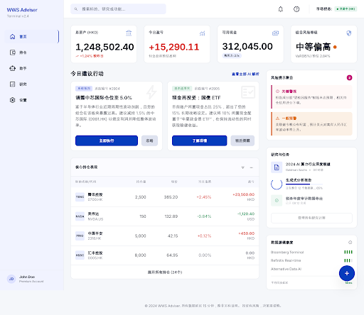 |
| HOME-01 | 首页总览（桌面端 v1，较早版本） | [打开](./HOME-01-desktop-v1.html) |  |
| PORT-02 | 标的 / 持仓详情 | [打开](./PORT-02-desktop.html) | 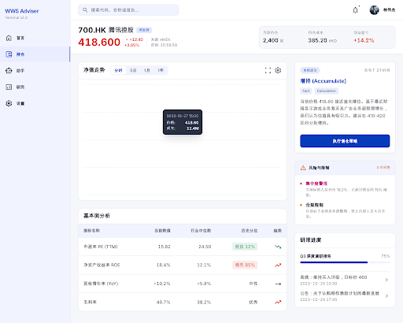 |
| TX-01 | 交易流水 | [打开](./TX-01-desktop.html) | 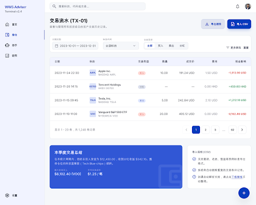 |
| ACC-01 | 账户与对账 | [打开](./ACC-01-desktop.html) | 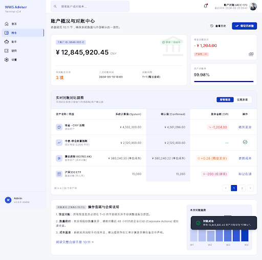 |
| CHAT-01 | 助手对话 | [打开](./CHAT-01-desktop.html) | 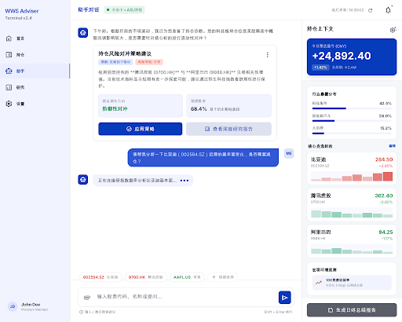 |
| LIB-01 | 研究与报告库 | [打开](./LIB-01-desktop.html) | 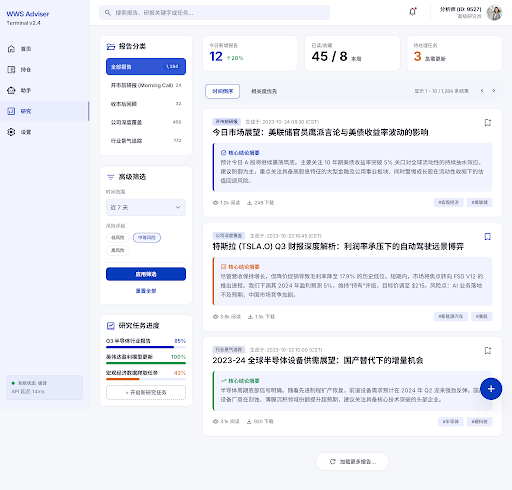 |
| REP-01 | 开市前报告 | [打开](./REP-01-desktop.html) | 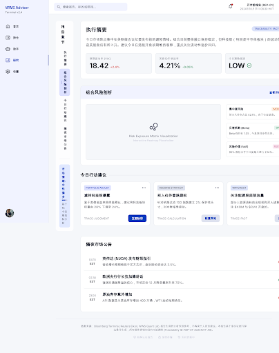 |
| DATA-01 | 数据状态中心 | [打开](./DATA-01-desktop.html) | 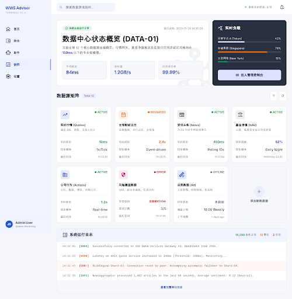 |
| SET-01 | 风险与投资约束 | [打开](./SET-01-desktop.html) | 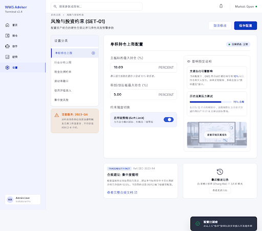 |

## 移动端核心页面

详见 [`mobile/manifest.json`](./mobile/manifest.json)。移动端为 PWA 主基准（390×844），Stitch 实际导出为 780 宽 2x 渲染。下表「主版本」为推荐走查稿（优先级：最终规范版 > 规范修正版 > 中文版 > 初版），其余版本保留供迭代对比。

| 页面 ID | 标题（主版本） | 主版本 HTML | 截图 | 其余版本 |
| --- | --- | --- | --- | --- |
| HOME-01 | 首页总览（最终规范版） | [打开](./mobile/HOME-01-mobile.html) | 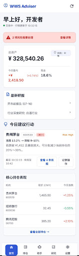 | [v1 初版](./mobile/HOME-01-mobile-v1.html)、[规范修正版 PNG](./mobile/HOME-01-mobile.png)（同主版本文件名冲突见 manifest） |
| PORT-02 | 标的详情（最终规范版） | [打开](./mobile/PORT-02-mobile.html) | 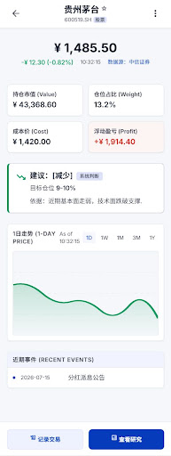 | [贵州茅台示例](./mobile/PORT-02-mobile-maotai.html)、[中文版](./mobile/PORT-02-mobile-cn.html)、[规范修正版](./mobile/PORT-02-mobile.html) |
| REP-01 | 开市前报告 | [打开](./mobile/REP-01-mobile.html) | 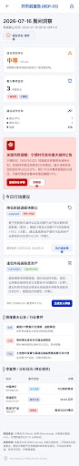 | — |
| LIB-01 | 研究与报告库 | [打开](./mobile/LIB-01-mobile.html) | 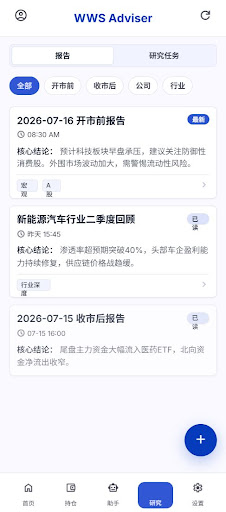 | — |
| TX-01 | 交易流水 | [打开](./mobile/TX-01-mobile.html) | 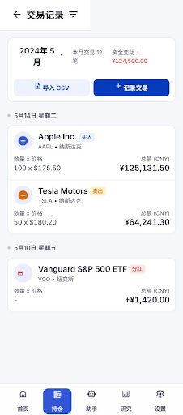 | — |
| TX-02 | 新建交易（中文版） | [打开](./mobile/TX-02-mobile.html) | 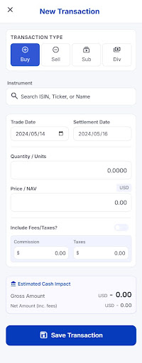 | [初版](./mobile/TX-02-mobile.html) |
| ACC-01 | 账户与对账 | [打开](./mobile/ACC-01-mobile.html) |  | — |
| CHAT-01 | 助手对话 | [打开](./mobile/CHAT-01-mobile.html) | 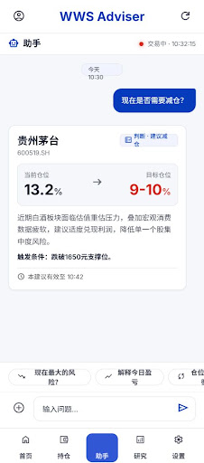 | — |
| DATA-01 | 数据状态中心 | [打开](./mobile/DATA-01-mobile.html) | 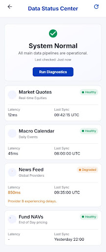 | — |
| SET-00 | 设置首页 | [打开](./mobile/SET-00-mobile.html) | 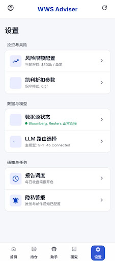 | — |
| SET-01 | 风险与投资约束（中文版） | [打开](./mobile/SET-01-mobile-cn.html) | 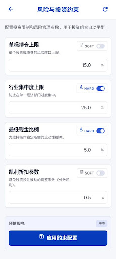 | [初版](./mobile/SET-01-mobile.html) |
| RES-01 | 新建研究 | [打开](./mobile/RES-01-mobile.html) | 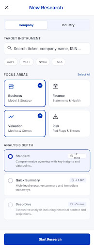 | [中文版](./mobile/RES-01-mobile-cn.html) |

> 注：`PORT-02-mobile-cn-390.html` 为 390 原始宽度版本，HTML 内容与 `PORT-02-mobile-cn.html` 完全一致（md5 相同），且 Stitch 端未生成对应 PNG；详见 mobile/manifest.json。

## 移动端覆盖情况（对照 UI 规范 §18.4 移动必交清单）

移动端已落地 **12 个独立页面 ID**（共 21 张稿含版本），覆盖 §4.3 P0 页面的主要导航目标。对照 §18.4 移动必交清单，**仍缺失**：

- AUTH-01 登录、ONB-01 首次配置向导
- HOME-02 今日行动与风险
- PORT-01 持仓与自选（移动列表）
- TX-03 CSV 导入向导
- CHAT-02 建议详情、CHAT-03 历史问询
- RES-02 研究任务进度
- REP-02 收市后复盘、REP-03 公司/行业研究报告
- SET-02 数据源与质量、SET-03 模型与任务路由、SET-04 通知与隐私、SET-05 任务时间、SET-06 安全与会话、SET-07 存储备份恢复、SET-08 系统状态
- SYS-01 全局搜索、SYS-02 通知中心
- 全局空 / 加载 / 异常 / 会话过期状态

## 桌面端缺口（未在 Stitch 项目中找到桌面稿）

对照 UI 规范 §18.4 桌面必交清单，以下页面目前 Stitch 里**只有移动端稿**，桌面端待补：

- PORT-01 持仓与自选（桌面表格）
- TX-03 CSV 导入向导（桌面）
- REP-02 收市后复盘
- REP-03 公司 / 行业研究报告（桌面三栏 + 证据抽屉）
- SET-02 数据源与质量
- SET-03 模型与任务路由
- SET-08 系统状态

## 走查提示（与 UI 规范硬规则对照）

打开 HTML 后重点检查这几条：

1. **行情红绿 vs 行动色不混用**（§7.3）：上涨红 / 下跌绿只用于行情；减少=橙、观察=琥珀、条件式增加=靛蓝、退出观察=洋红、暂停=灰。
2. **时间 / 来源 / 有效期常驻**（§8.3）：行情、净值、建议、报告底部必须显示"截至 … · 来源 …"。
3. **暂停建议不显示目标数量**（§9.3 硬规则）：PAUSE 变体只显示原因 + 可用事实。
4. **凯利区块反精确化**（§10.13）：一位小数、固定诚实旁注、拒绝原因显式化、折扣原因链。
5. **数字 tabular-nums + 空 `—`**（§8.1 / §7.4）：已确认 HTML 里 `font-feature-settings: 'tnum' on`。

## 目录文件清单

完整元数据见 `manifest.json`（本目录桌面端）与 [`mobile/manifest.json`](./mobile/manifest.json)（移动端），含每个屏幕的 Stitch id、宽高、文件大小。
